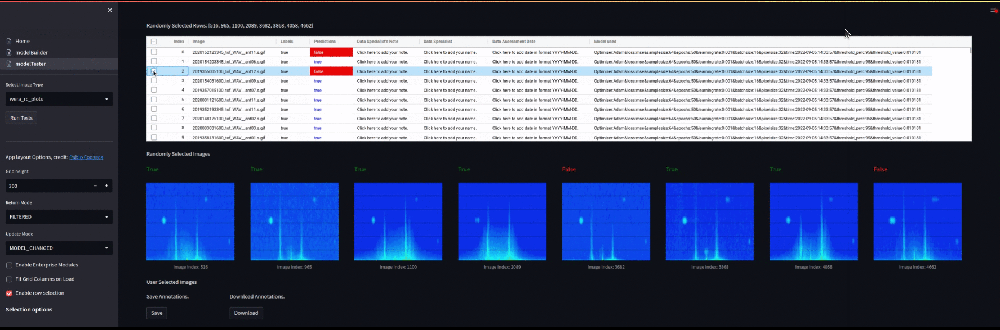

<h1  style="color:orange">   Autoencoder  Models Builder
 </h1> 

 

<a> Anomaly detection using basic autoencoders </a>

    

This repository contains a streamlit app that I built and used to train and test autoencoder models for  the conference paper [Anomaly detection in complex data: a practical application when outliers are few
](https://ieeexplore.ieee.org/document/9977351). 
Only Dense layers were used in the models. I ran out of time to finish the models with CNN layers. 
New models can be trained and and saved using this app. However, due to expected resource constraints in the free deployment server, the app should be used locally. Even when testing the provided models with the **larger datasets can give the server troubles, and the app may crash**. An image will be added to DockerHub soon to make it easier to run the app locally.
In addition to the hydrophone spectrogram images used in the paper, the models in this repo are trained on WERA radar Range-Cell (RC) images. Only a subset, including the final model ( model_build_time 14/08/2022 00:40) presented in the paper, of the models are included in this repo.

Details to come soon.

#### The model training component:

#### The model testing component:

#### Credits: 
 
 - [https://www.tensorflow.org/](https://www.tensorflow.org/)

 -  All data credit to Ocean Networks Canada (ONC)
 

 Reference Links:

 - [https://www.tensorflow.org/tutorials/generative/autoencoder](https://www.tensorflow.org/tutorials/generative/autoencoder)

 - [https://www.jeremyjordan.me/autoencoders/](https://www.jeremyjordan.me/autoencoders/)

  - [https://www.nature.com/articles/s41598-020-80610-9](https://www.nature.com/articles/s41598-020-80610-9)

 